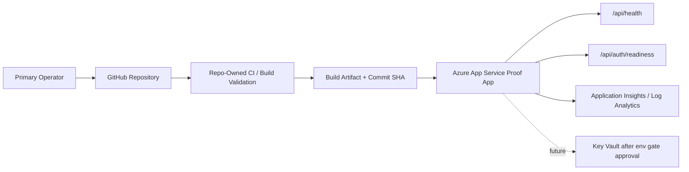

# WO-DEPLOY-010A Azure App Service Proof Design Packet

## Result

OWNER DECISION REQUIRED.

This packet designs the Azure App Service proof path for WilliamOS/TerraGroq.
It does not authorize Azure login, Azure resource creation, deployment, env
migration, DNS changes, Vercel changes, GitHub rules changes, or production
cutover.

## Context

WO-DEPLOY-009A selected Azure App Service as the recommended first Azure proof
path because it is the lowest-complexity managed Node hosting option and avoids
containerization work before the owner approves it.

Container Apps remains the stronger later path if the owner explicitly approves
containerization and image-digest provenance.

## Proof Goal

Prove that WilliamOS can run on Azure App Service as a governed staging/proof
target while Vercel remains unchanged and non-blocking.

The proof should answer:

1. Can the Next.js app build and run on Azure App Service?
2. Can health/readiness routes be verified from the Azure-hosted endpoint?
3. Can deployment provenance identify the commit, build, and deployment source?
4. Can runtime env requirements be represented without committing secrets?
5. Can rollback remain a no-change posture for current production?
6. Can security headers and auth readiness remain intact?

## Recommended Architecture



## Azure Resource List

Future proof resources may include:

| Resource | Purpose | Notes |
| --- | --- | --- |
| Resource Group | Isolate the proof | Owner selects subscription, region, and naming |
| App Service Plan | Host the proof app | Linux plan recommended |
| Linux App Service | Run WilliamOS proof | Node runtime; production slot not required for first proof |
| User-assigned Managed Identity | Future Azure-native identity boundary | No secret access until explicitly approved |
| Application Insights | App telemetry and error evidence | Read-only verification evidence |
| Log Analytics Workspace | Central logs for proof | Supports operational evidence |
| Key Vault | Future secret source | Do not create or bind until env/secret gate approval |

Not included in this proof design:

- Azure SQL or database migration
- Azure Storage
- Azure Container Registry
- Container Apps
- DNS cutover
- Vercel removal
- production traffic migration

## Environment Inventory Template

No secrets are included in this packet.

| Variable | Required For Proof | Source | Notes |
| --- | --- | --- | --- |
| `DATABASE_URL` | yes | owner-provided proof setting | Existing production value must not be copied without explicit env approval |
| `BETTER_AUTH_SECRET` | yes | owner-provided proof setting | Secret value remains outside git |
| `BETTER_AUTH_URL` | yes | Azure proof URL after app creation | Must match proof endpoint |
| `BETTER_AUTH_TRUSTED_ORIGINS` | yes | Azure proof URL plus current allowed origins | Required for origin diagnostics |
| `AUTH_EMAIL_OTP_ENABLED` | no | keep false/unset | OTP remains disabled |
| `RESEND_API_KEY` | no | not configured | No email sending in proof |
| `AUTH_EMAIL_FROM` | no | not configured | No email sending in proof |
| `ACCESS_GRANTS_ENABLED` | no | keep false/unset | Access grants remain disabled |

Env rules:

- no secrets in docs, git, PR bodies, screenshots, or logs
- no env migration before an explicit owner env gate
- proof may use placeholder inventory until env gate is approved
- readiness must clearly report missing configuration if env is incomplete

## Deployment Provenance Design

The proof must be able to identify:

- Git commit SHA
- branch or tag source
- build command and result
- deployment artifact identifier
- Azure App Service app name
- deployment timestamp
- health/readiness verification timestamp
- rollback target

Preferred provenance model:

1. repo-owned validation passes locally or in CI
2. build artifact is tied to a commit SHA
3. App Service deployment records the commit SHA in app settings or deployment
   metadata only after owner approval
4. verification report records proof URL, commit, health, readiness, and headers

Provenance is incomplete until the proof can show which commit is currently
served by the Azure endpoint.

## CI / Check Replacement Design

The Azure proof should not make Azure a required merge gate immediately.

Recommended sequence:

1. keep repo-owned checks as the merge-critical gate
2. add Azure proof verification as informational evidence
3. require proof health/readiness only for WOs that explicitly target Azure
4. promote Azure proof checks only after reliability is demonstrated
5. keep Vercel non-blocking unless a WO explicitly targets Vercel

Minimum repo-owned checks:

- `git diff --check`
- full test suite
- `npm run build`
- scope/safety confirmation

Azure-specific checks after approval:

- proof deployment completed
- Azure proof `/api/health` returns 200 ok
- Azure proof `/api/auth/readiness` returns ready true or expected missing-config
  status for incomplete env
- security headers present
- `x-powered-by` absent

## Health and Readiness Verification Plan

Proof verification should check:

| Endpoint | Expected |
| --- | --- |
| `/api/health` | 200 ok |
| `/api/auth/readiness` | 200 with `ready:true` only after env is configured |
| `/goal-console` | 200 route reachable |
| `/operator` | 200 route reachable |
| `/runtime` | 200 route reachable |

Header verification should check:

- `x-content-type-options: nosniff`
- `referrer-policy: strict-origin-when-cross-origin`
- `x-frame-options: DENY`
- `permissions-policy: camera=(), microphone=(), geolocation=()`
- `x-powered-by` absent

Auth/access posture should confirm:

- bootstrap signup remains locked when operator exists
- Email OTP remains disabled unless separately authorized
- access grants remain disabled
- no social login is enabled

## Rollback / No-Change Plan

Before proof approval:

- current production remains unchanged
- Vercel remains attached and non-blocking
- DNS remains unchanged
- no production traffic routes to Azure

During proof, rollback means:

- stop using the Azure proof endpoint
- delete or disable proof resources only under a separate cleanup WO
- keep current production serving from the existing platform
- do not alter auth, DB, DNS, or Vercel settings as rollback side effects

## Cost, Security, and Operations Notes

Cost:

- owner must approve subscription, region, App Service Plan tier, and budget
  ceiling before any resource exists
- proof should prefer the smallest tier that can validate build/runtime behavior
- logs/telemetry retention should be bounded

Security:

- use managed identity for future Azure-native access
- do not grant Key Vault or data-plane permissions before a separate secret gate
- do not hardcode credentials
- do not copy production secrets without explicit owner approval
- keep access grants and OTP disabled

Operations:

- App Service reduces OS patching and reverse-proxy burden compared with a VM
- proof should produce operational evidence, not become production by accident
- deployment and rollback commands belong in a later approved implementation WO

## Owner Input Checklist

| Input | Required Before Proof | Owner Answer |
| --- | --- | --- |
| Azure App Service proof approved? | yes | Pending |
| Azure subscription/tenant | yes | Pending |
| Azure region | yes | Pending |
| Resource group name | yes | Pending |
| App Service Plan tier/budget | yes | Pending |
| Proof app name | yes | Pending |
| Env migration approved? | yes/no | Pending |
| DNS change approved? | no for first proof | NO |
| Vercel change approved? | no | NO |
| Key Vault approved? | not for first proof | Deferred |
| Production traffic migration approved? | no | NO |

## Go / No-Go Decision Table

| Gate | Status |
| --- | --- |
| Owner approves App Service proof | Pending |
| Azure login/access authorized | Not approved |
| Azure resource creation authorized | Not approved |
| Env migration authorized | Not approved |
| DNS change authorized | Not approved |
| Deployment authorized | Not approved |
| Production cutover authorized | Not approved |
| Vercel changes authorized | Not approved |
| Auth/access behavior changes authorized | Not approved |

## Next Work Order Split

If approved:

- WO-DEPLOY-011A - Azure App Service Proof Provisioning Gate

If owner wants more design before Azure access:

- WO-DEPLOY-011B - Azure App Service Env and Secret Gate Design

If owner wants container provenance instead:

- WO-DEPLOY-010B - Azure Container Apps Containerization Decision Packet

If deferred:

- WO-DEPLOY-011D - Production Platform Hold / Product Work Resume Packet

If rejected:

- WO-DEPLOY-011E - Non-Azure Production Target Decision Packet

## Explicitly Not Authorized

This packet does not authorize:

- Azure login/access
- Azure resource creation
- deployment
- DNS changes
- Vercel changes
- env secret creation or migration
- GitHub rules changes
- package/dependency changes
- code/runtime behavior changes
- DB/schema changes
- auth/access behavior changes
- Hermes/MCP/autonomy
- release/tag
- production-write behavior

## Owner Decision Block

```text
OWNER_DECISION:
Approve Azure App Service proof: YES/NO
Azure subscription/tenant:
Azure region:
Resource group:
App Service Plan tier/budget:
Proof app name:
Env migration authorized: YES/NO
DNS change authorized: NO unless separately approved
Vercel change authorized: NO unless separately approved
Deployment authorized: NO unless separately approved
Production cutover authorized: NO
Next authorized WO:
```
