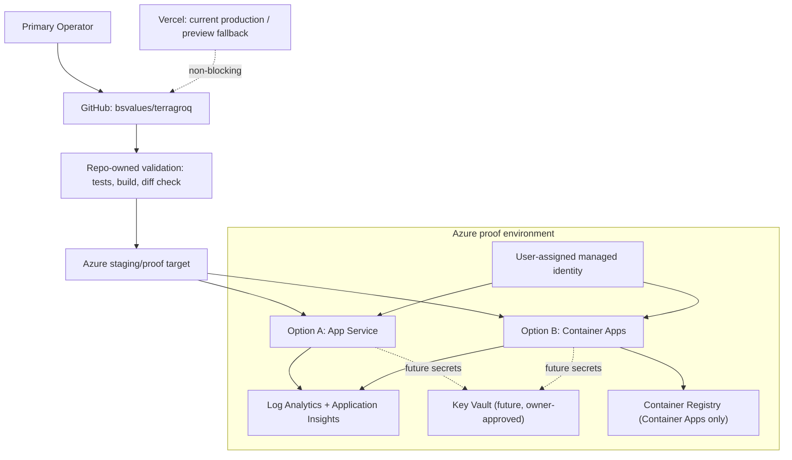

# WO-DEPLOY-008A Azure Architecture and Runbook Design

## Result

RUNBOOK READY FOR OWNER REVIEW.

This document designs an Azure staging/proof architecture for
WilliamOS/TerraGroq. It does not authorize Azure login, Azure resource creation,
deployment, DNS changes, Vercel changes, environment changes, GitHub rules
changes, package changes, code/runtime behavior changes, or production writes.

## Goal

Define the Azure staging/proof architecture and runbook before any Azure
resource is created or accessed.

## Recommendation

Recommended hosting path:

1. Azure App Service for the first Azure proof if the owner wants the lowest
   app-hosting complexity.
2. Azure Container Apps if the owner accepts containerization and wants a
   stronger long-term provenance and managed identity path.
3. Azure VM only if direct server control inside Azure is required.
4. Do not use Azure Static Web Apps for the current app shape.

Recommended next decision:

- choose App Service vs Container Apps before any Azure resource work.

## Why Not Static Web Apps

WilliamOS currently includes server routes, auth readiness, database-backed
behavior, and runtime health checks. Static Web Apps is not the right first
target unless the application is split into a static frontend and separately
hosted API, which is out of scope for this lane.

## Architecture Option A - Azure App Service

Best for:

- simpler managed Node hosting
- lower deployment architecture complexity
- quick staging/proof without containerization

Core resources:

- Azure App Service Plan
- Azure App Service for WilliamOS
- Application Insights
- Log Analytics Workspace
- optional Key Vault for secrets after owner approval

Design notes:

- attach user-assigned managed identity
- enable Application Insights via connection string setting
- define diagnostic settings
- use Linux App Service plan for Node runtime
- use app settings or Key Vault references only after env migration approval

## Architecture Option B - Azure Container Apps

Best for:

- stronger artifact provenance through container image digest
- managed identity and ACR pull separation
- future multi-service or worker boundaries
- clearer long-term Azure-native path

Core resources:

- Azure Container Apps environment
- Azure Container App for WilliamOS
- Azure Container Registry
- user-assigned managed identity
- AcrPull role assignment
- Application Insights
- Log Analytics Workspace
- optional Key Vault for secrets after owner approval

Design notes from Azure deployment guidance:

- Container Apps should use user-assigned managed identity.
- AcrPull role assignment is required for the managed identity.
- Container App environment should connect to Log Analytics.
- Key Vault can store secrets later, but secret migration is a separate gate.
- Containerization work must be approved separately before any Dockerfile or
  package/build changes.

## Architecture Option C - Azure VM

Best for:

- direct server control inside Azure
- parity with owned VPS/VM runbook
- simpler mental model than managed container platform for some operators

Risks:

- OS hardening, patching, process management, firewall, backups, and logs remain
  owner responsibilities.
- It duplicates most VPS operational burden while adding Azure account/resource
  governance.

Use only if App Service and Container Apps are rejected.

## Proposed Mermaid Architecture



## Environment Variable Inventory

No secrets are created or migrated by this runbook.

| Variable | Purpose | Azure Handling |
| --- | --- | --- |
| `DATABASE_URL` | Postgres connection | app setting or Key Vault after owner env gate |
| `BETTER_AUTH_SECRET` | auth signing secret | app setting or Key Vault after owner env gate |
| `BETTER_AUTH_URL` | canonical auth base URL | proof hostname for staging only |
| `BETTER_AUTH_TRUSTED_ORIGINS` | allowed origins | include proof hostname only after owner approval |
| `AUTH_SIGNUP_MODE` | signup policy | preserve current bootstrap/closed posture |
| `AUTH_EMAIL_OTP_ENABLED` | OTP flag | keep `false` unless separately authorized |
| `RESEND_API_KEY` | email provider secret | do not migrate in proof unless separately authorized |
| `AUTH_EMAIL_FROM` | email sender | do not enable without OTP/email gate |
| `ACCESS_GRANTS_ENABLED` | access grant activation | keep disabled |
| `OPENAI_API_KEY` or gateway equivalent | model/provider access | app setting or Key Vault after owner env gate |

## CI and Check Model

Repo-owned checks required before Azure proof:

- `git diff --check`
- full test suite
- `npm run build`
- secret scan or explicit no-secret diff review
- route smoke plan for proof host
- access-grant disabled check while access grants remain inactive
- security-header check

Azure-specific checks after proof exists:

- deployed artifact or image digest recorded
- Azure resource name and resource group recorded
- health check passes
- auth readiness passes
- security headers pass
- rollback target recorded

## Deployment Provenance Model

Every Azure proof claim must include:

- approved source commit SHA
- deployment timestamp
- Azure subscription/tenant label, without secret values
- resource group
- Azure app resource name
- hosting option: App Service, Container Apps, or VM
- artifact ID:
  - App Service: deployment artifact/build ID
  - Container Apps: container image digest
  - VM: release directory and commit SHA
- validation evidence used before deploy
- health/readiness/security-header evidence after deploy
- rollback target

## Health and Readiness Verification

Future proof host checks:

```powershell
Invoke-WebRequest https://<azure-proof-host>/api/health -UseBasicParsing
Invoke-WebRequest https://<azure-proof-host>/api/auth/readiness -UseBasicParsing
Invoke-WebRequest https://<azure-proof-host>/goal-console -UseBasicParsing
Invoke-WebRequest https://<azure-proof-host>/api/access-grants/issue -Method POST -Body '{}' -ContentType 'application/json' -UseBasicParsing
Invoke-WebRequest https://<azure-proof-host>/api/access-grants/accept -Method POST -Body '{}' -ContentType 'application/json' -UseBasicParsing
```

Expected:

- `/api/health` returns `200` and `status: ok`
- `/api/auth/readiness` returns `200` and `ready: true`
- `/goal-console` returns `200`
- security headers are present
- `x-powered-by` is absent
- access grant issue/accept routes remain disabled
- Hermes/MCP/autonomy remain disabled

## Rollback and No-Change Plan

Before any traffic or DNS change:

- Vercel remains current production/fallback
- Azure proof uses separate proof host
- no production DNS cutover
- no auth origin replacement
- no env migration unless separately authorized
- no access grant or OTP activation

Rollback options by hosting target:

- App Service: previous deployment artifact or deployment slot after slot design
- Container Apps: previous revision or image digest
- VM: previous release directory
- Current fallback: Vercel production until owner changes production target

## Cost, Ops, and Security Considerations

Cost:

- owner must set Azure budget ceiling before provisioning
- use minimal proof resources first
- avoid production-grade redundancy until proof succeeds

Operations:

- App Service has the lowest operational burden.
- Container Apps has a stronger future service boundary but requires container
  workflow decisions.
- VM has the highest operational burden.

Security:

- prefer managed identity over static credentials where possible
- use Key Vault only after secret strategy is approved
- do not migrate secrets in architecture phase
- keep disabled features disabled by default
- record diagnostic/logging posture before proof

## Owner Decision Checklist

| Decision | Recommended Answer | Owner Answer |
| --- | --- | --- |
| Azure posture | staging/proof target | Pending |
| Hosting option | App Service first, Container Apps if containerization approved | Pending |
| Allow Azure login/use now | No | Pending |
| Allow Azure resource creation now | No | Pending |
| Allow containerization work now | Separate decision | Pending |
| Allow env migration now | No | Pending |
| Allow DNS change now | No | Pending |
| Keep Vercel during proof | Yes, fallback/non-blocking | Pending |
| Next Work Order | Azure hosting option decision | Pending |

## Explicitly Not Authorized

- Azure login or access
- Azure resource creation
- deployment
- DNS changes
- Vercel changes
- env secret creation or migration
- GitHub rules changes
- package/dependency changes
- code/runtime behavior changes
- DB/schema changes
- auth/access behavior changes
- Hermes/MCP/autonomy activation
- release or tag
- production-write behavior

## Next Recommended Work Order

`WO-DEPLOY-009A - Azure Hosting Option Decision Gate`

Mode: owner decision only.

Goal: choose Azure App Service, Azure Container Apps, Azure VM, or defer Azure
before any Azure login, resource creation, containerization, env migration, DNS,
or deployment work.
