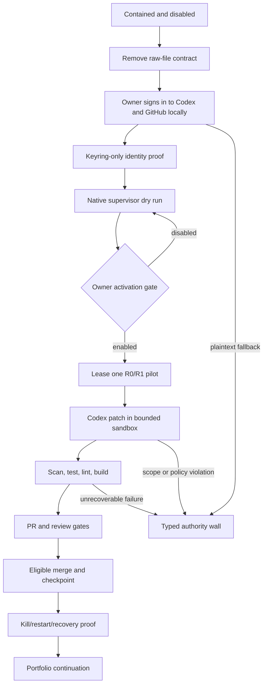

# WilliamOS Local-Identity Runtime Operator Playbook

Program: `PROGRAM-WILLIAMOS-LOCAL-IDENTITY-RUNTIME-001`

Goal: `GOAL-RUNTIME-OPERATOR-LOCAL-IDENTITY-001`

Loop: `LOOP-RUNTIME-OPERATOR-LOCAL-IDENTITY-001`

Base: `origin/main = 2832c7487ea35af8fdcf315934ce8406acc7bf9f`

Risk ceiling: `R2` for the program; leased product Work Orders remain limited
to policy-eligible `R0` and `R1`.

Status: playbook authorized; implementation and runtime activation remain
separate governed steps.

## Outcome

Replace the raw-file credential design with a bounded Phase 1 operator that
runs under William's normal Windows user identity on the HP OMEN.

The target state is:

- no OpenAI API key in GitHub, the repository, Docker secrets, environment
  files, or William-created credential files;
- no manually created GitHub token or PAT file;
- Codex CLI signed in through William's ChatGPT subscription;
- Codex authentication stored in Windows Credential Manager through
  `cli_auth_credentials_store = "keyring"`;
- GitHub CLI signed in through its browser flow and stored in the system
  credential store;
- the identity-bearing supervisor runs natively in William's Windows user
  session;
- Docker may provide an isolated validation sandbox, but it does not receive,
  copy, broker, mount, or cache the operator identity;
- activation remains owner-controlled, local, reversible, and disabled by
  default;
- the operator can perform only registered, dependency-ready R0/R1 Work Orders;
- all other actions stop at typed authority walls.

This playbook does not activate the operator.

## Why the Host Model Changes

The current inert implementation runs Codex CLI and GitHub CLI inside a Linux
container and expects raw values at
`%USERPROFILE%\.williamos\runtime-operator\secrets`. Windows Credential
Manager is not that container's credential store. Passing cached credentials
or raw tokens into the container would re-create the secret-file problem under
a different name.

Therefore Phase 1 separates identity from isolation:

- Windows owns authentication, scheduling, leasing, publishing, and the kill
  switch.
- Codex CLI and GitHub CLI run under William's signed-in Windows account.
- Optional Docker validation receives repository content and commands only,
  never authentication material.
- The existing Docker operator remains disabled until it is removed or reduced
  to a non-identity validation role.

## Official Authentication Basis

OpenAI documents that local Codex supports ChatGPT sign-in for subscription
access, automatically refreshes active ChatGPT sessions, and can store cached
credentials in the operating-system credential store using:

```toml
cli_auth_credentials_store = "keyring"
forced_login_method = "chatgpt"
```

Source:
[OpenAI Codex authentication](https://learn.chatgpt.com/docs/auth)

GitHub CLI documents that its normal browser login stores the resulting token
in the system credential store when one is available.

Source:
[GitHub CLI authentication](https://cli.github.com/manual/gh_auth_login)

Neither login flow may be scripted, copied into evidence, or performed by the
runtime operator. William performs the two interactive sign-ins locally.

## /goal

Build and prove a locally authenticated, continuously resumable WilliamOS
operator without raw owner-managed API-key or PAT files.

Success requires:

1. current containment remains true;
2. the raw-file contract is removed from code and doctrine;
3. Windows keyring-backed Codex and GitHub identities are verified without
   exposing values;
4. the native supervisor is disabled by default and fail-closed;
5. one low-risk pilot completes through lease, patch, validation, PR, review,
   eligible merge, checkpoint closure, evidence, and deterministic
   continuation;
6. kill, restart, duplicate-run, stale-lease, auth-expiry, and recovery behavior
   are proven;
7. the portfolio resolver resumes normal eligible work;
8. PACS, county systems, protected data, TerraFusion production, deployments,
   releases, secrets administration, and destructive actions remain outside
   authority.

## /loop

Selection rule: choose the first incomplete Work Order whose dependencies and
authority gates are satisfied.

Continue automatically through implementation, tests, PRs, reviews, eligible
merges, evidence, and the next Work Order.

Stop only for:

- either interactive owner login;
- owner activation or revocation;
- keyring unavailability or plaintext fallback;
- permission expansion;
- host administration requiring elevation;
- any action above R1;
- PACS, county, protected-data, TerraFusion-production, deploy, release,
  secrets-administration, or destructive scope;
- an unrecoverable failure after bounded remediation.

A completed Work Order, opened PR, pending check, review comment, merged PR,
restart, or context compaction is not a terminal condition.

## Lifecycle



## Decision Gates

| Gate | Decision | Pass condition | Failure result |
| --- | --- | --- | --- |
| G0 | Containment | GitHub secret absent, Actions operator absent, local activation disabled | Stop and re-contain |
| G1 | OpenAI identity | `codex login status` confirms ChatGPT login; keyring forced | Owner login or keyring wall |
| G2 | GitHub identity | `gh auth status` succeeds from William's user session; secure store verified | Owner login or credential-store wall |
| G3 | Host boundary | Identity-bearing commands run natively; Docker receives no auth material | Architecture remediation |
| G4 | Dry run | No lease, patch, push, or mutation while disabled | Fail closed |
| G5 | Activation | William explicitly changes local switch to enabled | Remain disabled |
| G6 | Pilot | One allowlisted R0/R1 WO completes with all gates and evidence | Disable and remediate |
| G7 | Continuation | Resolver selects only approved dependency-ready work | Stop at typed authority wall |

## Authority Matrix

| Action | Codex | Owner | Blocked |
| --- | --- | --- | --- |
| Maintain playbook, code, tests, and evidence | yes | review visibility | no |
| Inspect login status without token output | yes | yes | no |
| Complete browser/device login | no | yes | unattended login |
| Change activation switch | no | yes | remote activation |
| Lease registered R0/R1 WO | yes after activation | no courier work | unregistered work |
| Create branch, commit, push, PR | yes inside policy | no courier work | other repositories |
| Remediate review and CI failures | yes inside scope | no courier work | scope expansion |
| Merge eligible R0/R1 PR | yes when policy permits | no courier work | bypassing gates |
| Add GitHub/OpenAI secrets | no | no for this design | always |
| PACS/county/protected-data access | no | separate future decision | always here |
| Deploy, release, tag, schema/data mutation | no | separate future decision | always here |

## Work Orders

### Phase A — Containment and Truth

#### WO-RUNTIME-IDENTITY-001 — Live Baseline and Containment Reconciliation

Purpose: prove the exact live state before modifying the runtime design.

Allowed changes: evidence and registry corrections only.

Acceptance:

- `origin/main` recorded;
- PRs #344 and #345 and issue #343 reconciled;
- GitHub `OPENAI_API_KEY` absence recorded without enumerating other secret
  names or values;
- GitHub Actions autonomous workflow absence verified;
- OMEN activation recorded as disabled;
- both legacy local credential placeholders recorded as zero-byte only;
- no workflow, container cycle, lease, or network mutation triggered.

Validation: read-only GitHub metadata, repository diff, local status output, and
secret-value-free evidence.

Rollback: none; this WO is read-only.

#### WO-RUNTIME-IDENTITY-002 — Credential-Custody Failure Record

Purpose: record why both the GitHub-hosted design and raw local secret-file
design failed the intended trust boundary.

Acceptance:

- distinguishes GitHub secret custody, raw local file custody, OS keyring
  custody, and runtime identity;
- records that host selection and credential custody require explicit owner
  decisions;
- prevents the portfolio resolver from inferring either;
- contains no credential values, prefixes, screenshots, or environment dumps.

Validation: governance consistency and secret scan.

#### WO-RUNTIME-IDENTITY-003 — Inert Docker Operator Freeze

Purpose: keep the deployed Docker operator incapable of work during redesign.

Acceptance:

- activation remains `disabled`;
- restart cannot bypass the activation check;
- no credential file is required merely to prove disabled state;
- no lease or external API call occurs while disabled;
- status clearly reports `SUPERSEDED_IDENTITY_HOST / DISABLED`.

Validation: focused disabled-start and restart tests.

Rollback: stop the container and retain disabled state.

#### WO-RUNTIME-IDENTITY-004 — Raw Credential Placeholder Retirement

Purpose: remove the expectation that William populate
`openai_api_key` or `github_token`.

Dependencies: 001–003.

Acceptance:

- provisioning no longer creates the two placeholders;
- Compose and supervisor no longer require or read them;
- runbook instructs the owner to leave or delete existing zero-byte files;
- code refuses non-empty legacy files and reports a migration wall without
  printing contents;
- repository and Docker configuration contain no raw-key mount contract.

Validation: exact-path search, focused tests, Compose validation, and secret
scan.

Rollback: restore the prior disabled-only commit without adding credentials.

### Phase B — Authentication and Host Boundary

#### WO-RUNTIME-IDENTITY-005 — Codex ChatGPT Login Contract

Purpose: use subscription-backed ChatGPT sign-in instead of
`OPENAI_API_KEY`.

Acceptance:

- `forced_login_method = "chatgpt"`;
- `cli_auth_credentials_store = "keyring"`;
- owner login command is documented as `codex login`;
- status proof uses `codex login status` and records only method/readiness;
- API-key fallback is disabled for this program;
- no auth cache is copied into Docker or repository paths.

Owner gate: William completes the browser or device-code login.

Failure: if keyring is unavailable or Codex falls back to
`~/.codex/auth.json`, stop without activation.

#### WO-RUNTIME-IDENTITY-006 — GitHub Browser Login Contract

Purpose: use GitHub CLI's local browser authentication and system credential
store instead of a PAT file.

Acceptance:

- owner login uses `gh auth login --hostname github.com --git-protocol https`;
- `gh auth setup-git` configures Git credential use;
- proof uses `gh auth status --hostname github.com`;
- no call to `gh auth token` is allowed in runtime code or evidence;
- no `GH_TOKEN`, `GITHUB_TOKEN`, PAT file, or token mount is required;
- the authenticated account and repository access are verified without token
  output.

Owner gate: William completes the browser flow.

Failure: plaintext fallback or overbroad/unexpected account access becomes a
typed authority wall.

#### WO-RUNTIME-IDENTITY-007 — Windows User-Context Runtime Decision

Purpose: make the identity-bearing runtime native to William's Windows account.

Acceptance:

- Codex and `gh` run outside Docker;
- the supervisor refuses `SYSTEM`, service accounts, elevated administrator,
  or a different Windows identity;
- Phase 1 runs only while William's user session can access the credential
  stores;
- “run whether user is logged on or not” is prohibited for Phase 1;
- always-on boot operation is deferred to Phase 2 architecture.

Validation: user SID and non-elevation assertions without recording sensitive
identity details.

#### WO-RUNTIME-IDENTITY-008 — Docker Validation-Only Boundary

Purpose: retain isolation benefits without sharing operator identity.

Acceptance:

- Docker may run tests, lint, builds, and patch safety checks;
- Docker receives a clean repository snapshot or worktree, never Codex or
  GitHub credentials;
- Docker cannot push, create PRs, read the host keyring, or change activation;
- all container network needs are documented and minimized;
- the identity-bearing Docker supervisor is removed or permanently disabled.

Validation: Compose inspection, mount inspection, environment-name scan, and a
negative credential-access test.

#### WO-RUNTIME-IDENTITY-009 — Authentication Status Adapter

Purpose: expose only safe readiness facts to the operator.

Output contract:

```json
{
  "codexAuth": "ready|missing|wrong-method|plaintext-fallback|unknown",
  "githubAuth": "ready|missing|wrong-account|plaintext-fallback|unknown",
  "activation": "enabled|disabled",
  "identityContext": "expected|unexpected",
  "ready": false
}
```

Acceptance:

- never returns usernames beyond the expected configured GitHub login;
- never returns tokens, token fragments, headers, auth-cache paths, environment
  values, or command transcripts;
- any unknown state fails closed.

#### WO-RUNTIME-IDENTITY-010 — Local Identity Threat Model

Purpose: model credential theft, prompt injection, malicious PRs, dependency
scripts, path traversal, patch exfiltration, poisoned tests, stale leases,
duplicate supervisors, and hostile workflow changes.

Acceptance:

- trust boundaries and assets identified;
- prevention, detection, response, and recovery controls mapped;
- residual risks classified;
- no pilot may start with an unmitigated critical/high risk.

### Phase C — Native Windows Supervisor

#### WO-RUNTIME-IDENTITY-011 — Native Runtime Directory Contract

Purpose: define local state without storing raw credentials.

Canonical root:

`%USERPROFILE%\.williamos\runtime-operator`

Allowed children:

- `control\activation`
- `state\`
- `audit\`
- `workspace\`
- `locks\`

Acceptance:

- no `secrets\` directory is created or required;
- ACLs restrict the root to William's account;
- runtime refuses reparse points, unexpected owners, or permissive ACLs;
- logs and checkpoints contain no auth material.

#### WO-RUNTIME-IDENTITY-012 — PowerShell Supervisor

Purpose: implement a serialized native supervisor under the normal user
session.

Acceptance:

- strict error handling;
- disabled-first startup;
- bounded polling and exponential retry;
- no shell-string interpolation of untrusted WO fields;
- process tree and child exit codes tracked;
- graceful stop within a defined timeout;
- crash leaves a recoverable checkpoint.

#### WO-RUNTIME-IDENTITY-013 — Activation and Kill Switch

Purpose: make owner intent explicit and immediately reversible.

Acceptance:

- activation file must equal exactly `enabled`;
- default and all errors resolve to disabled;
- stop writes `disabled` before terminating processes;
- a killed supervisor cannot restart work without a new owner enable action;
- status reports activation without changing it;
- remote issues, PRs, prompts, or portfolio state cannot activate the worker.

#### WO-RUNTIME-IDENTITY-014 — Single-Instance Lock and Host Lease

Purpose: prevent concurrent native or Docker operators.

Acceptance:

- atomic host lock;
- PID plus process-start validation;
- stale-lock recovery;
- active Docker identity supervisor detected as a conflict;
- second instance exits without leasing work.

#### WO-RUNTIME-IDENTITY-015 — Durable Checkpoint Store

Purpose: resume safely across crash, logout, reboot, and network loss.

States:

`READY`, `LEASED`, `PATCH_PREPARED`, `VALIDATING`, `PR_OPEN`,
`REVIEW_REMEDIATION`, `MERGE_READY`, `COMPLETED`, `BLOCKED`,
`FAILED_RECOVERABLE`, `FAILED_TERMINAL`.

Acceptance:

- atomic writes;
- schema version;
- repository, goal, loop, WO, base SHA, branch, PR, and attempt recorded;
- no prompt body, model output, token, or environment dump persisted;
- corrupt state fails closed and preserves evidence.

#### WO-RUNTIME-IDENTITY-016 — Workspace and Git Safety

Purpose: isolate each leased WO.

Acceptance:

- clean worktree from verified `origin/main`;
- exact repository allowlist: `bsvalues/terragroq`;
- no force push, tag, release, submodule mutation, or destructive reset of user
  worktrees;
- runtime-owned worktree naming;
- dirty/untracked state classification;
- cleanup only for runtime-owned paths.

#### WO-RUNTIME-IDENTITY-017 — Codex Non-Interactive Adapter

Purpose: call `codex exec` using cached ChatGPT authentication.

Acceptance:

- login readiness checked before invocation;
- schema-bound output;
- explicit sandbox and approval policy;
- bounded timeout and output size;
- no API-key environment variable;
- no auth-file path passed to the process;
- authority wall and no-change results handled deterministically.

#### WO-RUNTIME-IDENTITY-018 — Patch Envelope and Path Policy

Purpose: ensure Codex proposes only inspectable repository changes.

Acceptance:

- unified patch plus structured result;
- exact changed-path inventory;
- path traversal, symlink escape, binary payload, generated-secret, workflow,
  auth, environment, package, DB/schema, deployment, and protected-path gates;
- patch applied only after policy pass;
- out-of-policy results become `BLOCKED`, never partial writes.

#### WO-RUNTIME-IDENTITY-019 — GitHub CLI Adapter

Purpose: perform bounded repository operations through the cached local
identity.

Allowed:

- fetch/clone the one repository;
- issue and PR reads;
- branch push;
- PR create/update;
- check and review monitoring;
- review-thread replies;
- eligible R0/R1 merge when existing policy permits.

Blocked:

- secrets, variables, workflow enable/run, repository settings, collaborators,
  teams, webhooks, deploy keys, releases, tags, other repositories, and
  permission changes.

#### WO-RUNTIME-IDENTITY-020 — Retry, Recovery, and Idempotency

Purpose: prevent duplicate branches, PRs, comments, merges, and checkpoints.

Acceptance:

- stable idempotency key from repository + WO + base SHA;
- bounded retry categories;
- no retry for authority, auth, scope, or secret failures;
- reconciliation before every write;
- restart resumes the last safe state.

#### WO-RUNTIME-IDENTITY-021 — Append-Only Audit Ledger

Purpose: preserve proof without credential leakage.

Acceptance:

- hash-chained JSONL or equivalent append-only records;
- event type, timestamp, WO, state transition, hashes, PR/check identifiers;
- no prompts, patches, auth output, environment dumps, or secret-like values;
- verification and tamper-detection command;
- retention and export policy.

#### WO-RUNTIME-IDENTITY-022 — Cost, Rate, and Run Budgets

Purpose: bound unattended consumption and runaway loops.

Acceptance:

- maximum cycles per hour and day;
- maximum Codex invocations per WO;
- maximum remediation attempts;
- maximum elapsed time;
- maximum changed files and patch size;
- cooldown after rate limits;
- budget exhaustion disables new leases and records a typed stop.

### Phase D — Safety and Verification

#### WO-RUNTIME-IDENTITY-023 — Authority Evaluator Integration

Purpose: reuse the canonical authority registry before every consequential
step.

Acceptance:

- only R0/R1 registered Work Orders;
- dependencies and base freshness required;
- all typed gates enforced before lease, patch, push, PR, and merge;
- portfolio selection cannot override host, identity, activation, or owner
  gates.

#### WO-RUNTIME-IDENTITY-024 — Secret and Exfiltration Defense

Purpose: prevent credential disclosure through code, logs, patches, child
processes, Git, or model input.

Acceptance:

- secret-name and secret-value-independent scanning;
- blocked environment enumeration;
- sanitized child environment;
- no auth-cache, credential-store, browser-profile, SSH-key, or user-profile
  traversal;
- outbound destinations limited to required OpenAI, GitHub, package, and
  approved validation endpoints;
- a suspected leak disables the operator and creates owner-only evidence.

#### WO-RUNTIME-IDENTITY-025 — Native Supervisor Test Suite

Required tests:

- disabled start;
- wrong user/elevation;
- missing and wrong auth method;
- plaintext fallback;
- stale and duplicate locks;
- malformed checkpoints;
- stale base;
- unsafe paths;
- secret-like patch;
- retry exhaustion;
- kill during every state;
- crash/restart recovery;
- duplicate PR prevention;
- blocked merge;
- zero-eligible-work idle state.

#### WO-RUNTIME-IDENTITY-026 — Disabled End-to-End Dry Run

Purpose: prove the installed supervisor cannot act while disabled.

Acceptance:

- status can be read;
- authentication readiness may be checked without value output;
- no issue lease;
- no Codex invocation;
- no Git write;
- no Docker credential access;
- no network mutation;
- audit records only the disabled proof.

#### WO-RUNTIME-IDENTITY-027 — Authenticated Read-Only Smoke

Owner dependencies: WOs 005 and 006 interactive logins complete.

Acceptance:

- Codex login status ready through ChatGPT;
- GitHub login status ready through secure store;
- repository metadata and `origin/main` read succeed;
- a schema-bound Codex no-change task succeeds;
- no branch, issue, PR, comment, merge, or activation change;
- no raw credential is created or displayed.

### Phase E — Controlled Pilot and Runtime Proof

#### WO-RUNTIME-IDENTITY-028 — Pilot Work Order Packet

Purpose: define one deterministic R0 documentation-only change.

Acceptance:

- exact allowed paths;
- no runtime/auth/workflow/config/package changes;
- test and evidence expectations;
- rollback;
- idempotency key;
- owner-visible preview;
- no real county, PACS, protected, or production data.

#### WO-RUNTIME-IDENTITY-029 — Owner Activation Gate

Owner action: William changes the local activation switch from `disabled` to
`enabled`.

Preconditions:

- G0–G4 pass;
- no high/critical threat remains;
- both logins are keyring-backed and ready;
- pilot packet is approved;
- kill command is tested immediately beforehand.

Codex may not simulate, infer, or automate this action.

#### WO-RUNTIME-IDENTITY-030 — One-Work-Order Pilot Execution

Purpose: prove lease through patch and validation.

Acceptance:

- exactly one pilot leased;
- one Codex invocation unless remediation is required;
- policy-safe patch;
- secret and path scans pass;
- focused tests, lint, full tests, and production build pass as required;
- runtime remains within budgets.

Failure: activation is set to disabled before remediation.

#### WO-RUNTIME-IDENTITY-031 — PR, Review, and Eligible Merge Proof

Acceptance:

- runtime-owned branch and PR;
- checks monitored to terminal state;
- actionable reviews remediated;
- zero unresolved substantive threads;
- merge only under the existing R0/R1 policy;
- post-merge main verified;
- no workflow, secret, setting, release, tag, or deployment mutation.

#### WO-RUNTIME-IDENTITY-032 — Kill, Restart, and Recovery Drill

Scenarios:

- kill while idle;
- kill after lease;
- kill after patch;
- restart with PR open;
- stale network;
- expired ChatGPT or GitHub login.

Acceptance:

- no duplicate work;
- no unsafe automatic reauthentication;
- auth expiry becomes an owner login wall;
- disabled state survives restart;
- checkpoints reconcile correctly.

### Phase F — Operationalization and Closure

#### WO-RUNTIME-IDENTITY-033 — At-Logon Scheduling

Purpose: start the disabled supervisor in William's user context.

Acceptance:

- Task Scheduler uses William's normal non-elevated account;
- trigger is at logon, not boot;
- task never stores a password supplied by the playbook;
- task starts disabled and respects the kill switch;
- “run whether user is logged on or not” remains off;
- removal command and rollback documented.

Owner gate: creating or changing the scheduled task if Windows requests
credentials or elevation.

#### WO-RUNTIME-IDENTITY-034 — Operator Status and Owner UX

Purpose: make state understandable without exposing internals.

Status must show:

- enabled/disabled;
- running/stopped;
- auth ready/not ready by method only;
- current goal/loop/WO;
- checkpoint;
- PR/check/review state;
- last successful cycle;
- next eligible action;
- exact owner wall, if any;
- kill-switch command.

#### WO-RUNTIME-IDENTITY-035 — Runbook, Academy, and Incident Procedure

Acceptance:

- setup from clean OMEN state;
- login and keyring verification;
- disabled proof;
- activation and kill;
- auth expiry and re-login;
- rollback and uninstall;
- suspected credential compromise response;
- no instructions to paste keys or tokens into files, terminals, chats, issues,
  reports, Docker, or GitHub secrets.

#### WO-RUNTIME-IDENTITY-036 — Final Safety and Evidence Rollup

Required evidence:

- all WOs and gates;
- tests, lint, full suite, build;
- PR checks and review threads;
- pilot and recovery proof;
- credential-custody negative proof;
- no GitHub secrets;
- no raw local credential files;
- no Docker auth mounts;
- no PACS/county/protected/TerraFusion-production contact;
- final `origin/main`;
- residual risks and Phase 2 boundary.

#### WO-RUNTIME-IDENTITY-037 — Portfolio Continuation Handoff

Purpose: return routine operation to the deterministic portfolio resolver.

Acceptance:

- runtime goal closed;
- loop marked complete;
- release-engineering program eligibility refreshed;
- operator automatically selects the next approved dependency-ready WO;
- William is not asked to courier routine continuation.

#### WO-RUNTIME-IDENTITY-038 — Phase 2 Ubuntu Decision Packet

Purpose: prepare but not execute the always-on migration.

The packet must compare:

- interactive/user-session auth versus service identity;
- OS keyring/Secret Service versus enterprise Codex access token;
- dedicated service account;
- encrypted host storage and backup;
- boot-time operation;
- credential rotation and revocation;
- OMEN-to-Ubuntu state transfer;
- single-active-host enforcement.

No Ubuntu deployment or credential movement is authorized by this WO.

## Validation Matrix

| Layer | Required proof |
| --- | --- |
| Documentation | Markdown links, IDs, dependencies, gates, rollback |
| Static code | formatting, lint, type checking, unit tests |
| Runtime | disabled E2E, read-only auth smoke, pilot, kill/restart |
| Security | threat model, secret scan, path controls, negative exfiltration tests |
| GitHub | correct repository, PR checks, review threads, merge proof |
| Host | expected user, non-elevated context, keyring readiness, task state |
| Product | no PACS/county/protected/TerraFusion-production touch |
| Evidence | append-only audit validation and final rollup |

## Standard Work Order Return

```text
RESULT:
PROGRAM:
GOAL:
LOOP:
WORK_ORDER:
BASE:
HOST:
IDENTITY_CONTEXT:
ACTIVATION:
BRANCH:
COMMIT:
PR:
MERGED:
FILES_CHANGED:
VALIDATION:
AUTH_READINESS:
SECRET_POSTURE:
REVIEW_THREADS:
RUNTIME_CHECKPOINT:
SAFETY_POSTURE:
OWNER_DECISION_REQUIRED:
OWNER_ACTION:
NEXT_RECOMMENDED_WO:
```

Credential values, fragments, environment dumps, auth cache contents, and
browser data are forbidden in this return.

## Stop Packet

When stopped, Codex returns only:

- typed wall;
- why owner authority is required;
- exact owner action;
- safe verification;
- rollback;
- precise resume WO and checkpoint.

It must not ask William to choose routine implementation details or relay Git
commands.

## Rollback Doctrine

- Any identity uncertainty: disable first.
- Any suspected credential exposure: disable, stop, revoke through the official
  provider UI, preserve sanitized evidence, and do not resume automatically.
- Any duplicate supervisor: stop both, reconcile checkpoints, then restart only
  one disabled instance.
- Any unsafe patch or path: discard the runtime-owned worktree and checkpoint
  `BLOCKED`.
- Any failed pilot: close or revert only runtime-owned changes through normal
  review; do not force-push shared branches.
- Any host migration: old host disabled and verified before new host activation.

## Standing Prohibitions

This program does not authorize:

- GitHub Actions as the autonomous operator host;
- GitHub repository or organization secrets;
- raw OpenAI keys, PATs, token files, copied auth caches, or Docker credential
  mounts;
- operation under SYSTEM, administrator, or an unexpected identity;
- hidden boot-time activation;
- cross-repository access;
- workflow, repository-setting, collaborator, secret, or permission changes;
- PACS, county systems, protected records, or owner-name data;
- TerraFusion production access or mutation;
- database, schema, environment, package-policy, deployment, release, or tag
  mutation outside a separately authorized WO;
- Hermes, MCP, memory-write, or skill activation;
- destructive commands or autonomous scope expansion.

## Next Action

Begin with `WO-RUNTIME-IDENTITY-001`. Runtime activation remains disabled.
